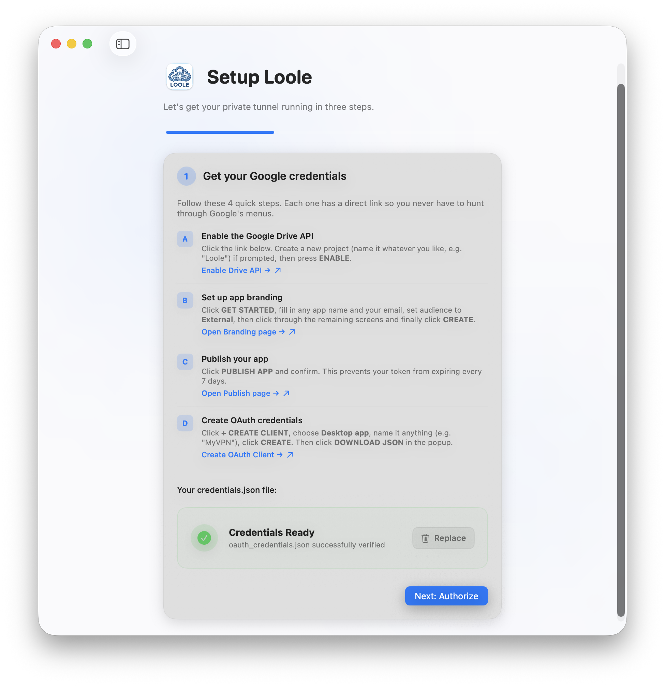
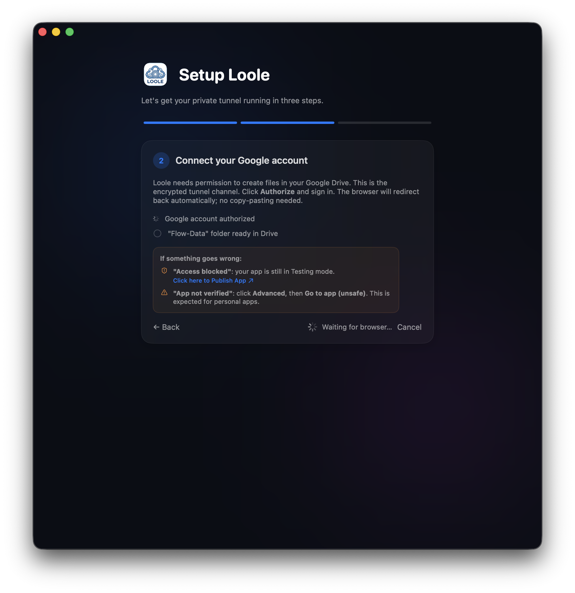
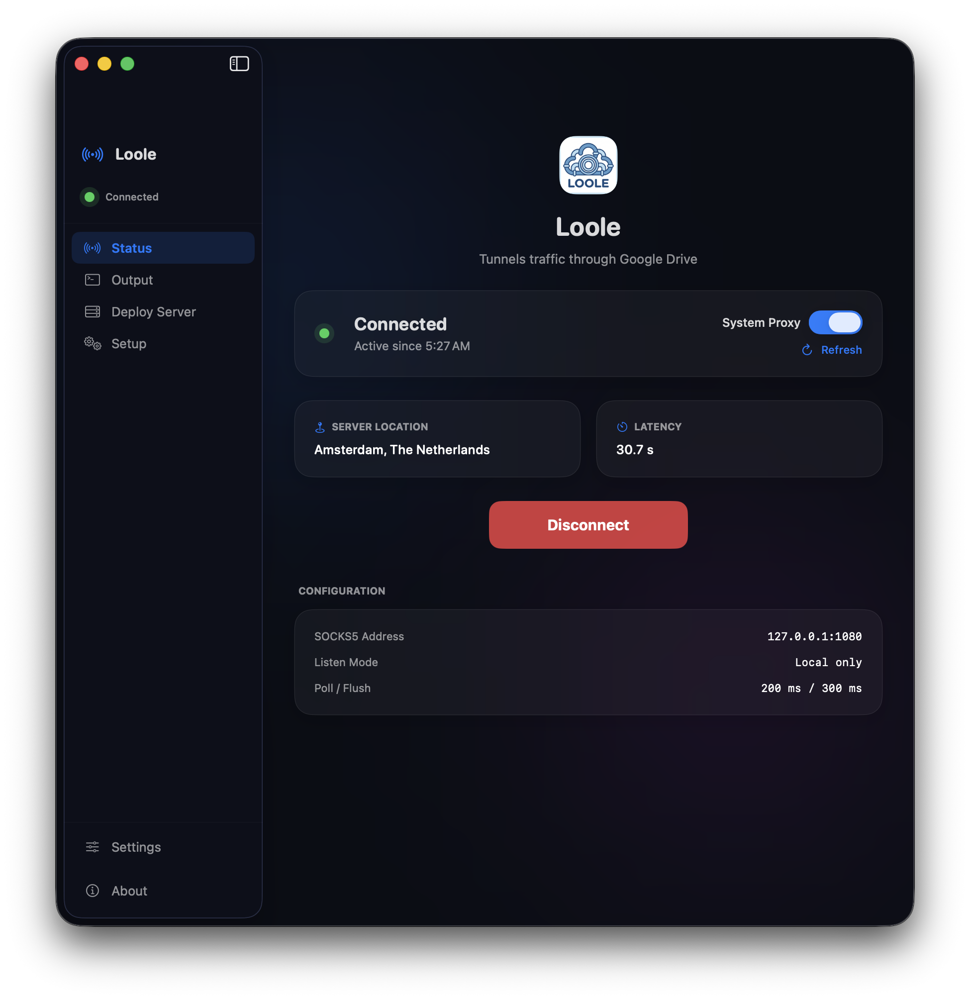

# Loole

**Loole** is a modern, high-performance SOCKS5 tunnel designed to bypass network restrictions by leveraging Google Drive as a covert transport layer. It provides a premium macOS experience with an automated setup wizard.

  
  
  

---

## Why Loole?

Most covert tunnels are difficult to set up, requiring manual configuration of JSON files and terminal commands. **Loole** changes that by providing a fully interactive macOS application that guides you through every step, from generating Google credentials to deploying your server.

### Key Features
- **Easy Guided Setup**: A 3-step wizard that handles the complexity of Google Cloud Console for you with direct links and instructions.
- **Automatic Authorization**: No more copy-pasting URLs from the terminal. Loole handles the OAuth2 handshake directly in your browser.
- **Connection Health Checker**: Real-time feedback on your connection quality, including **ping latency** and **server location** (GeoIP).
- **One-Click System Proxy**: Toggle system-wide SOCKS5 proxy support instantly with passwordless privilege elevation (one-time setup).
- **Built-in Server Packager**: Automatically packages your customized server binary for **x86_64** or **ARM64** architectures, ready to be dropped onto your VPS.
- **Premium macOS UI**: Designed with native glassmorphism and modern aesthetics for a seamless desktop experience.

---

## Requirements
To use Loole, you will need:
1.  **A Linux Server (VPS)**: Any basic VPS (Ubuntu/Debian recommended) to host the server-side tunnel.
2.  **A Google Account**: To use Google Drive as the encrypted data channel.

---

## How it Works
Loole treats a hidden folder in your Google Drive as a bi-directional data queue:
1.  **Client (Mac)**: Packages your local network requests into a compact binary protocol and uploads them to Drive.
2.  **Server (VPS)**: Constantly polls the Drive folder, executes the requests, and uploads the responses back.

Since the traffic looks like legitimate Google API calls (Drive file movements), it is highly resistant to deep packet inspection (DPI) and blocking.

---

## Getting Started

1.  **Download the latest release** (or build from source using `./scripts/build-app.sh`).
2.  **Open Loole** and follow the Step 1 (Credentials) guide to get your Google Cloud JSON.
3.  **Authorize** the app with your Google account.
4.  **Deploy the Server**: Follow the built-in instructions to copy the automatically generated ZIP file to your Linux server and run it.
5.  **Connect** and enjoy your private tunnel!

---

## Donations

If you find Loole helpful, consider supporting the development. Every bit helps in maintaining and improving the project!

- **TON**: `UQCriHkMUa6h9oN059tyC23T13OsQhGGM3hUS2S4IYRBZgvx`
- **USDT (BEP20)**: `0x71F41696c60C4693305e67eE3Baa650a4E3dA796`
- **TRX (TRON)**: `TFrCzU7bDey9WSh3fhqCBqhaiMzr8VhcUV`

---

## Disclaimer
This project is intended for personal usage and research purposes only. Please do not use it for illegal purposes. The author is not responsible for any misuse of this tool.
